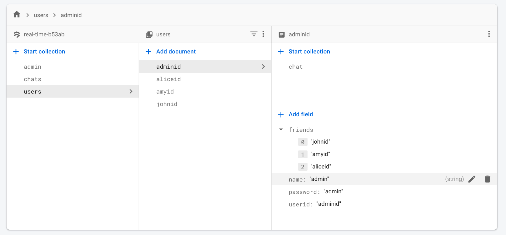
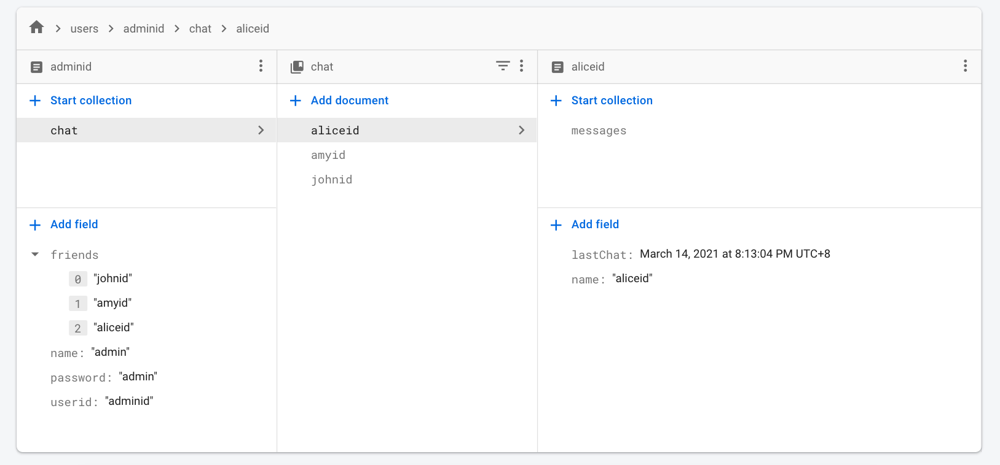
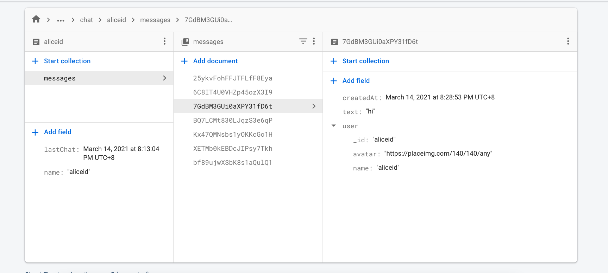

### Env set up
1. Have to have nodejs and npm installed.
2. [Download Android Studio for Android emulator][https://reactnative.dev/docs/environment-setup] download necessary SDK, Xcode for ios emulator.
3. Place the `google-services.json` file in the `/android/app/` directory, like: `/android/app/google-services.json`.
4. Run `npm install`, then run `npm start` to start metro server, then do `npx react-native run-android`, or `npx react-native run-ios`.


This app works with firebase -> Firestore -> realtime database

Tips:

Have to install **`@react-native-firebase/firestore`**, **`@react-native-firebase/database`**, `@react-native-firebase/auth` and `@react-native-firebase/app` all four!

When you download a new copy of **google-services.json**, have to do `npm install` to make it load.


### For geo-location:

https://heartbeat.fritz.ai/how-to-use-the-geolocation-api-in-a-react-native-app-b5e611b00a0c

1.  `npm install @react-native-community/geolocation --save`
2.  `navigator.geolocation = require('@react-native-community/geolocation');`
3.  Enable location permssion.

```javascript
// ...
const [location, setLocation] = useState();
// ...
navigator.geolocation.getCurrentPosition(
      position => {
        const location = JSON.stringify(position);
        setLocation(location);
      },
      error => Alert.alert(error.message)
       ,
      { enableHighAccuracy: true, timeout: 20000, maximumAge: 1000 }
    );
```

## Firestore snapshot







